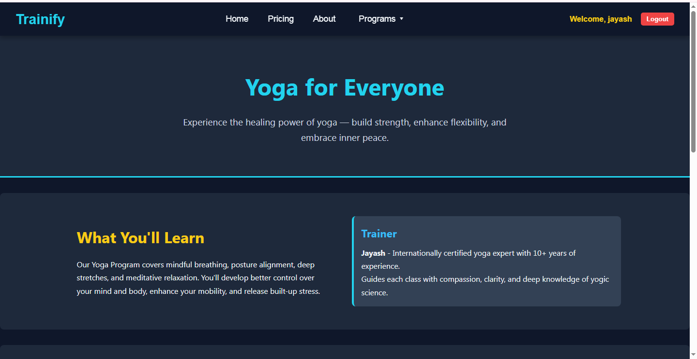

# Trainify - Full-Stack Fitness App
## MERN STACK
Developed a full-stack fitness app with secure user authentication, personalized workout plans, video tutorials,

and subscription-based premium plans.

Built RESTful APIs with Node.js & Express; managed MongoDB for efficient data storage.

Designed responsive UI using React, HTML, and CSS for seamless user experience.

# Developed by Jayash

### 🏠 Home Page

### 🏋️ Workout Plans

### 💁‍♂️ Workout Tips

### 🔻 Footer

### 📝 Registration Page

### 🔐 Login Page

### 🔓 After Login Page

### 💰 Pricing

### 🤑 Payment

### 📄 paySlip

### ℹ️ About

### 🧘 Yoga Pages

## 🚀 Features

- 📝 User Registration and Login
- 🧘 View Workout Plans and Packages
- 🛒 Purchase Subscriptions
- 🔐 Protected Routes 
- 📁 Clean Folder Structure: Separate frontend and backend

---

## 🛠️ Tech Stack

| Layer      | Technology                 |
|------------|----------------------------|
| Frontend   | React, React Router, Axios |
| Backend    | Node.js, Express.js        |
| Database   | MongoDB + Mongoose         |

---

## Start Backend Server

- cd backend
- npm install
- npm start

## Start Frontend Server

- cd frontend
- npm install
- npm start /npm run dev

