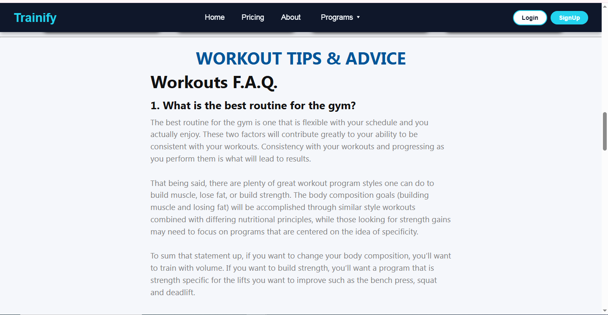
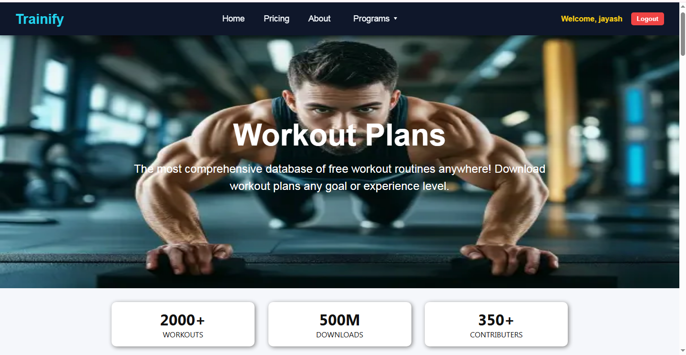
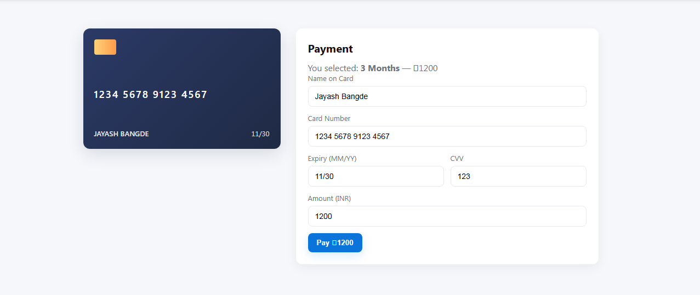
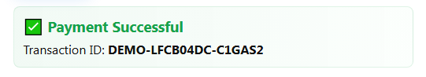
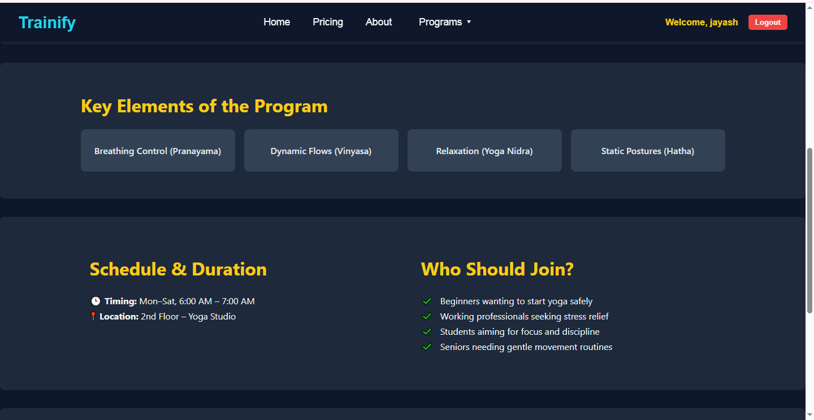

# Trainify - Full-Stack Fitness App
## MERN STACK
Developed a full-stack fitness app with secure user authentication, personalized workout plans, video tutorials,

and subscription-based premium plans.

Built RESTful APIs with Node.js & Express; managed MongoDB for efficient data storage.

Designed responsive UI using React, HTML, and CSS for seamless user experience.

# Developed by Jayash

## 🏠 Home Page

